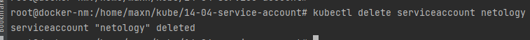

# 14-04-service-account

### Создание сервис аккаунта


### Просмотр списка сервис аккаунтов


### Информация об аккаунте в yaml

```shell
root@docker-nm:/home/maxn/kube/14-04-service-account# kubectl get serviceaccount netology -o yaml
apiVersion: v1
kind: ServiceAccount
metadata:
  creationTimestamp: "2022-05-27T07:49:31Z"
  name: netology
  namespace: prod
  resourceVersion: "7053297"
  uid: d8e44ea2-4dd5-4551-8c63-bb53c7a29de0
secrets:
- name: netology-token-g4krx
```

### Информация об аккаунте в JSON

```shell
root@docker-nm:/home/maxn/kube/14-04-service-account# kubectl get serviceaccount default -o json
{
    "apiVersion": "v1",
    "kind": "ServiceAccount",
    "metadata": {
        "creationTimestamp": "2022-04-23T11:58:41Z",
        "name": "default",
        "namespace": "prod",
        "resourceVersion": "3159741",
        "uid": "936ae189-8a99-4b67-af3e-d8ba243f64c0"
    },
    "secrets": [
        {
            "name": "default-token-jr5z7"
        }
    ]
}
```

### Выгрузка в файла сервис аккаунта


### Удаление сервис аккаунта



### Загрузка из файла сервис аккаунта


